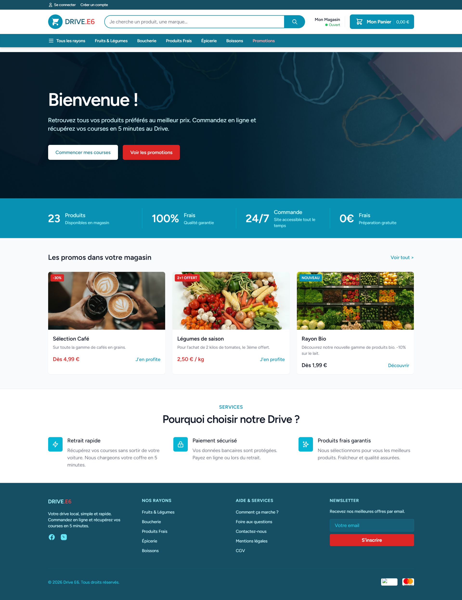
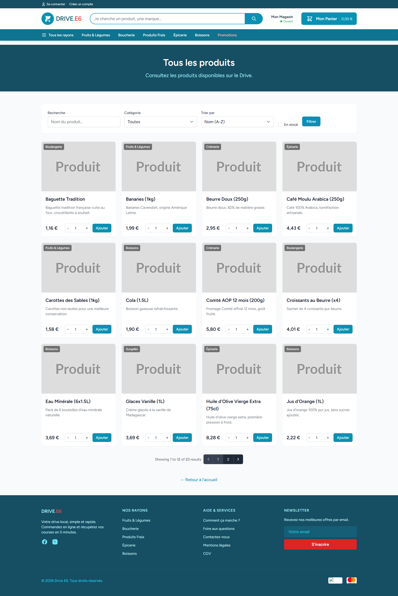
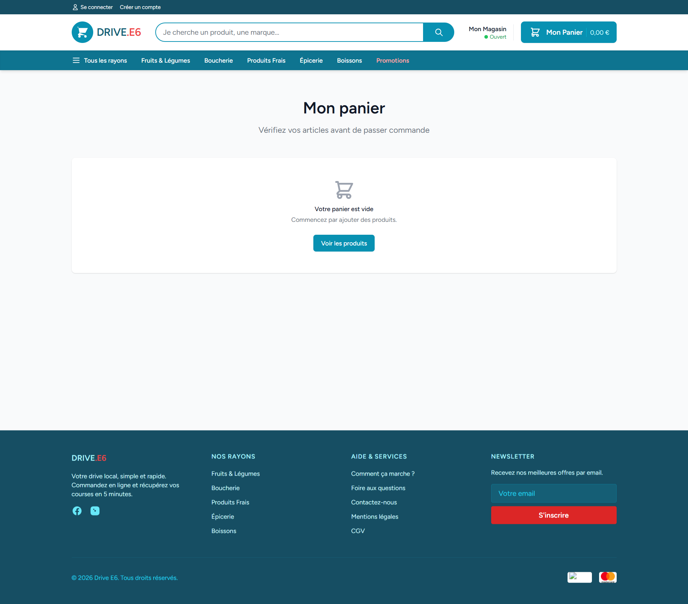
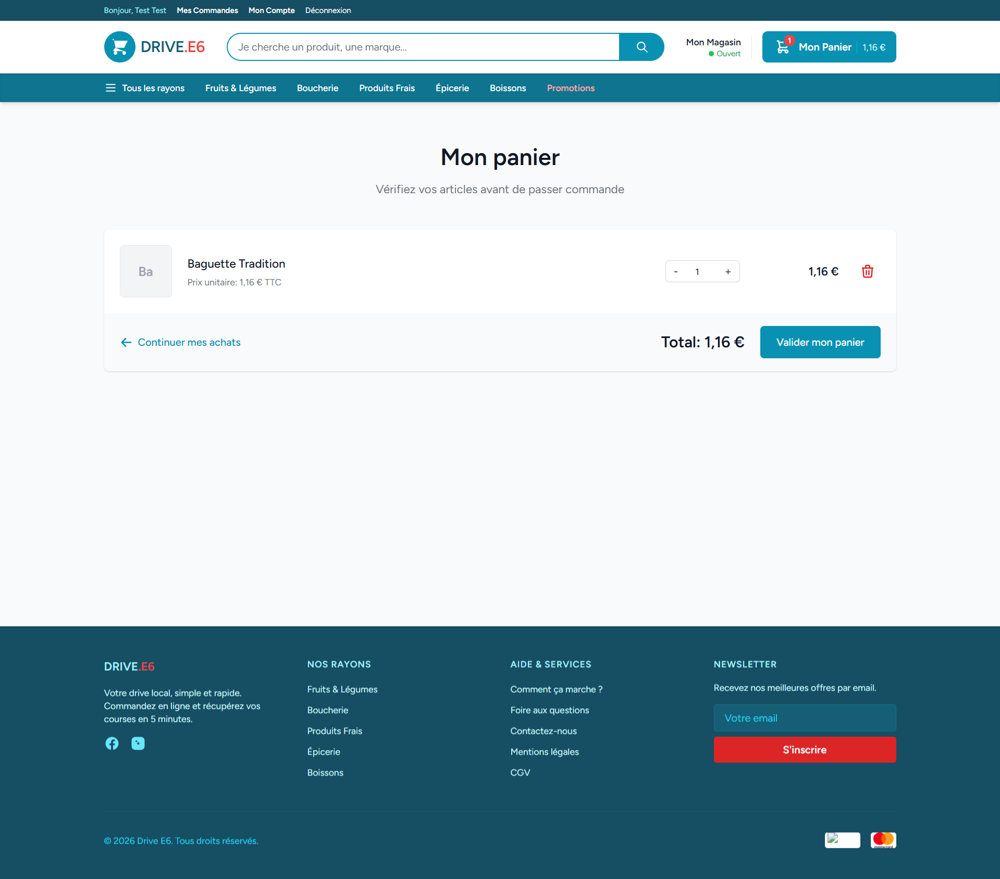
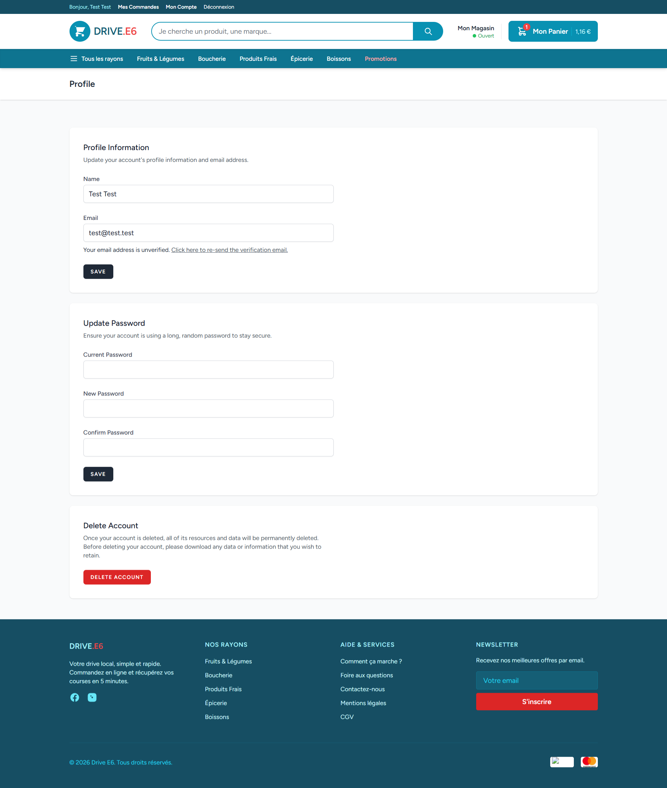
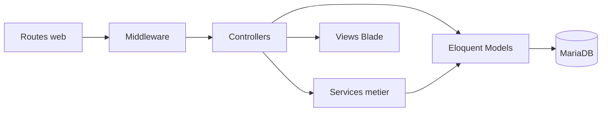
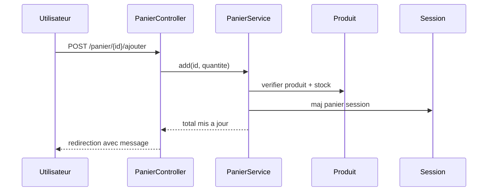
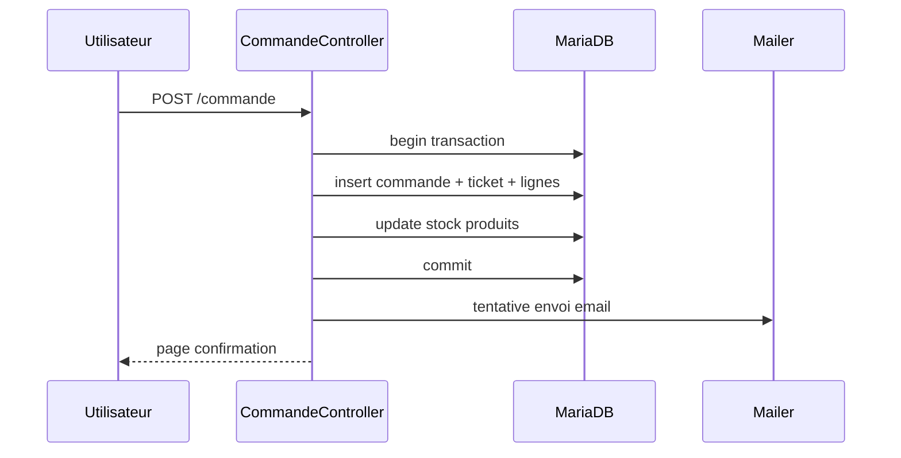

# Documentation Technique Ultra Complete - Application Web Drive E6

Version du document: 3.0
Date: 20/04/2026
Public: Jury technique et non technique, techniciens, maintenance applicative

---

## Comment lire ce document

Ce document est volontairement structure en 3 niveaux:

1. Niveau A - Lecture metier (non developpeur)
2. Niveau B - Lecture technicienne (exploitation, support, procedure)
3. Niveau C - Lecture developpeur (architecture, code, SQL, evolution)

Objectif: permettre a un membre du jury non dev de comprendre le projet, tout en donnant un niveau de detail suffisant a un jury dev/technique.

---

# Niveau A - Vue claire pour non developpeur

## A1. Resume executif

L'application est une application web de gestion d'un drive alimentaire (front client + back-office admin). Elle permet:

- de consulter un catalogue de produits par categories
- de rechercher et filtrer les produits
- de remplir un panier puis valider une commande
- de gerer un compte client (profil, mot de passe)
- d'administrer les produits via un espace reserve

Valeur metier:

- digitalisation du parcours client
- reduction des erreurs de prise de commande
- mise a jour rapide du catalogue en back-office
- socle evolutif pour promotions et gestion de preparation

<div style="page-break-after: always;"></div>

## A2. Fonctions principales (langage metier)

### Accueil

La page d'accueil met en avant les promotions et les points forts du service (rapidite, disponibilite, qualite).

### Catalogue produits

Le client visualise les produits, filtre par categorie, trie, recherche et ajoute des quantites au panier.

### Panier

Le client modifie les quantites, supprime des lignes et visualise le total avant validation.

### Commande

Apres connexion, le client finalise la commande avec creneau de retrait et mode de paiement (simulation), puis recoit une confirmation.

### Mon compte

Le client met a jour son profil, son email et son mot de passe, ou supprime son compte.

### Administration

Un utilisateur admin accede a un espace securise pour piloter les produits (CRUD) et suivre des indicateurs.

---

## A3. Ecrans (preuves visuelles)

### Ecran accueil



<div style="page-break-after: always;"></div>

### Ecran catalogue produits



### Ecran panier vide



<div style="page-break-after: always;"></div>

### Ecran panier avec article



### Ecran profil utilisateur



<div style="page-break-after: always;"></div>

## A4. Roles utilisateurs

| Role | Acces |
|---|---|
| visiteur | accueil, produits, promotions, panier |
| utilisateur connecte | visiteur + commande + gestion du profil |
| administrateur | utilisateur connecte + espace admin (/admin) |

---

## A5. Risques metier et reponses

| Risque | Impact | Reponse actuelle |
|---|---|---|
| indisponibilite base MariaDB | application inutilisable | conteneur DB dedie + healthcheck Docker |
| rupture de stock apres ajout panier | incoherence de commande | controle stock dans PanierService |
| acces non autorise au back-office | exposition de fonctions sensibles | middleware auth + AdminMiddleware |
| echec envoi email confirmation | client non notifie | envoi non bloquant + trace d'erreur |
| erreur de saisie profil | donnees clients incorrectes | validation Laravel cote serveur |

<div style="page-break-after: always;"></div>

# Niveau B - Vue technicienne (exploitation/support)

## B1. Fiche technique rapide

- Type: application web Laravel (MVC)
- Langage: PHP 8.2+
- Framework: Laravel 12
- Front: Blade + Tailwind CSS + Alpine.js + Vite
- Base de donnees: MariaDB 10.11
- ACL: Bouncer (roles et abilities)
- Conteneurisation: Docker Compose

---

## B2. Prerequis d'installation

- Windows 10/11, Linux ou macOS
- Docker + Docker Compose
- PHP 8.2+ et Composer (si execution hors Docker)
- Node.js + npm (assets front)
- fichier .env configure

---

## B3. Installation pas a pas

1. Cloner le depot
2. Installer dependances PHP
3. Installer dependances front
4. Creer le fichier .env
5. Generer la cle applicative
6. Lancer Docker Compose
7. Executer migrations + seed
8. Compiler les assets

Commandes:

```bash
composer install
npm install
cp .env.example .env
php artisan key:generate
docker compose up -d
php artisan migrate:fresh --seed
npm run build
```

Note importante:

Le projet peut tourner en mode local classique ou en conteneurs. En contexte jury/recette, privilegier Docker pour reproductibilite.

<div style="page-break-after: always;"></div>

## B4. Configuration locale

Fichier principal: .env

Parametres critiques:

- APP_ENV, APP_DEBUG, APP_KEY, APP_URL
- DB_HOST, DB_PORT, DB_DATABASE, DB_USERNAME, DB_PASSWORD
- MAIL_MAILER, MAIL_HOST, MAIL_PORT, MAIL_USERNAME, MAIL_PASSWORD
- CACHE_DRIVER, SESSION_DRIVER, QUEUE_CONNECTION

Exemple cible local (indicatif):

```dotenv
APP_ENV=local
APP_DEBUG=true
APP_URL=http://localhost

DB_CONNECTION=mysql
DB_HOST=127.0.0.1
DB_PORT=3306
DB_DATABASE=drive_db
DB_USERNAME=root
DB_PASSWORD=
```

---

## B5. Demarrage et verification technique

Au demarrage, la plateforme:

1. charge la configuration Laravel
2. initialise les services applicatifs
3. connecte MariaDB
4. sert les pages Blade
5. charge les assets Vite compiles

Checklist verification rapide:

- page accueil chargee
- page produits chargee avec cartes
- ajout panier possible
- profil accessible apres connexion
- routes admin protegees

---

## B6. Operations de support

### Verifier statut des conteneurs

```bash
docker compose ps
```

### Consulter les logs application et base

```bash
docker compose logs -f app
docker compose logs -f db
```

### Vider caches Laravel

```bash
php artisan optimize:clear
```

### Rebuild propre des conteneurs

```bash
docker compose down
docker compose up -d --build
```

---

## B7. Guide de depannage (N1/N2)

### Cas 1 - Erreur de connexion DB

Symptomes:

- erreurs SQL a l'affichage
- pages en erreur 500

Actions:

1. verifier variables DB dans .env
2. verifier etat du conteneur db
3. verifier credentials MariaDB
4. relancer migration si schema absent

### Cas 2 - Assets manquants (manifest Vite)

Symptomes:

- styles absents
- message de manifest introuvable

Action:

```bash
npm run build
```

### Cas 3 - Droits d'ecriture Laravel

Symptomes:

- erreurs sur storage ou cache

Actions:

1. verifier permissions storage et bootstrap/cache
2. corriger proprietaire/droits dans le conteneur app

### Cas 4 - Route admin inaccessible

Symptomes:

- redirection ou 403 sur /admin

Actions:

1. verifier authentification
2. verifier role admin (is_admin / bouncer)
3. verifier AdminMiddleware

<div style="page-break-after: always;"></div>

## B8. Securite exploitation

### Points deja en place

- hash des mots de passe natif Laravel
- middleware auth/verified
- protection CSRF
- validation serveur sur formulaires sensibles
- isolation route admin par middleware

### Points de vigilance

- APP_DEBUG doit etre false en production
- secret applicatifs uniquement via .env (jamais en dur)
- coherer version PHP conteneur et version cible composer

---

## B9. Sauvegarde et reprise

### Sauvegarde recommandee

- dump MariaDB quotidien
- retention minimum 7 jours
- sauvegarde des fichiers utilisateur (storage/app/public)

### Procedure de reprise

1. restaurer dump DB
2. restaurer storage si necessaire
3. verifier .env
4. relancer conteneurs
5. lancer tests smoke (accueil, login, panier, commande)

---

## B10. Tests de non regression (technicien)

- affichage accueil
- recherche produit
- filtre categorie
- ajout au panier
- modification quantite panier
- suppression ligne panier
- passage en commande (utilisateur connecte)
- mise a jour profil utilisateur
- acces admin et CRUD produit

<div style="page-break-after: always;"></div>

# Niveau C - Vue developpeur / jury technique

## C1. Architecture logique



---

## C2. Structure du code

- app/Http/Controllers: controleurs front, panier, commande, admin
- app/Http/Middleware: controle d'acces
- app/Services: logique metier (PanierService)
- app/Models: modeles Eloquent
- database/migrations: schema relationnel
- resources/views: templates Blade
- routes/web.php: routes HTTP
- config/: configuration framework
- tests/: tests feature et unit

---

## C3. Bootstrap et cycle de requete

Sequence technique standard:

1. requete HTTP sur une route Laravel
2. execution des middlewares (session, csrf, auth, admin)
3. routage vers controller cible
4. appel eventuel a la couche service
5. lecture/ecriture DB via Eloquent/Query Builder
6. rendu Blade ou redirection

Fichiers pivots:

- bootstrap/app.php
- app/Http/Kernel.php
- routes/web.php

<div style="page-break-after: always;"></div>

## C4. Cartographie des routes principales

### Front-office

- GET / : accueil
- GET /produits : catalogue
- GET /promotions : promotions
- GET /produits/{id} : detail
- GET /panier : consultation panier
- POST /panier/{id}/ajouter : ajout article
- PATCH /panier/{id} : maj quantite
- DELETE /panier/{id} : suppression ligne

### Profil utilisateur (auth)

- GET /profile
- PATCH /profile
- DELETE /profile

### Commandes

- GET /commande/create (auth)
- POST /commande (auth)
- GET /commande (auth)
- GET /commande/{id}
- GET /commande/confirmation/{id}

### Administration

- Prefixe /admin
- middleware auth + AdminMiddleware
- dashboard et CRUD produits

---

## C5. Description des composants principaux

## C5.1 ProduitsController

Responsabilites:

- listing catalogue public
- tri, filtrage, recherche, pagination
- affichage detail produit
- affichage promotions

## C5.2 PanierController + PanierService

Responsabilites:

- gestion des lignes panier en session
- ajout/modification/suppression
- calculs montants (HT/TVA/TTC)
- application des promotions

## C5.3 CommandeController

Responsabilites:

- finalisation commande (auth)
- creation transactionnelle commande + ticket + lignes
- decrement du stock
- envoi email de confirmation non bloquant

## C5.4 AdminController

Responsabilites:

- dashboard de synthese
- statistiques (produits, tickets, clients, CA)
- pilotage espace admin

## C5.5 AdminMiddleware

Responsabilites:

- verifier utilisateur connecte
- verifier droits admin
- proteger les routes sensibles

<div style="page-break-after: always;"></div>

## C6. Service metier detaille: PanierService

Fonctions metier:

- gestion du panier en session
- controle existence produit
- controle quantite versus stock
- calcul total panier et remises

Regles de remise:

- pourcentage: reduction proportionnelle
- montant: reduction fixe par unite
- offert: lot base sur min_quantite

Optimisation:

- cache des promotions (cle promotions_all, TTL 1h)

---

## C7. Schema base de donnees

## C7.1 Tables metier principales

- users
- clients
- produits
- promotions
- commandes
- lignes_commandes
- tickets
- lignes_tickets
- preparations

## C7.2 Relations principales

- commandes.client_id -> clients.id
- lignes_commandes.commande_id -> commandes.id
- lignes_commandes.produit_id -> produits.id
- lignes_tickets.ticket_id -> tickets.id
- lignes_tickets.produit_id -> produits.id

## C7.3 Contraintes fonctionnelles notables

- reference produit unique
- numero_commande unique
- controle stock avant validation
- colonnes statut pour suivi du cycle commande

---

## C8. Flux metier detaille

## C8.1 Flux "Ajout au panier"



## C8.2 Flux "Validation commande"



---

## C9. Securite technique

### C9.1 Bonnes pratiques en place

- auth Laravel standard
- verification email active
- middleware d'autorisation admin
- CSRF natif Laravel
- hash password natif Laravel
- validation des entrees serveur

### C9.2 Points de vigilance

- route detail commande en acces public a auditer selon regle metier cible
- dualite users/clients a clarifier pour controle d'acces strict
- gestion secrets et mode debug a verrouiller en production

### C9.3 Plan de remediations priorise

1. verrouiller acces detail commande (policy/gate)
2. unifier mapping user-client ou documenter strictement la correspondance
3. externaliser secrets et activer politique de rotation
4. passer email en file asynchrone (queue)

<div style="page-break-after: always;"></div>

## C10. Qualite et tests

### C10.1 Outillage en place

- PHPUnit
- PHPStan + Larastan
- Laravel Pint

### C10.2 Commandes qualite

```bash
php artisan test
./vendor/bin/phpstan analyse
./vendor/bin/pint
```

### C10.3 Plan de progression tests

- renforcer tests feature sur panier/commande
- ajouter tests d'autorisation admin
- ajouter tests de non regression sur promotions
- integrer qualite statique dans pipeline CI

---

## C11. Performance et scalabilite

### C11.1 Observations

- pagination deja presente cote catalogue
- charge DB concentree sur parcours panier/commande
- usage cache promotions pour limiter requetes repetitives

### C11.2 Optimisations proposees

- indexation complementaire sur statuts et creneaux
- file asynchrone pour email et taches lentes
- surveillance metriques SQL et temps de reponse

---

## C12. Observabilite et exploitation

### C12.1 Traces existantes

- logs Laravel (storage/logs)
- logs conteneurs Docker

### C12.2 Cible recommandee

- journalisation structuree par niveau
- correlation des actions critiques (commande/admin)
- tableau de bord indicateurs techniques et metiers

---

## C13. Matrice exigences -> composants -> preuves

| Exigence | Composant principal | Preuve |
|---|---|---|
| navigation catalogue | ProduitsController + views produits | ecran catalogue |
| gestion panier | PanierController + PanierService | ecrans panier vide/plein |
| compte utilisateur | ProfileController + auth Laravel | ecran profil |
| commande client | CommandeController + models transactionnels | routes commande + confirmation |
| administration | AdminController + AdminMiddleware | acces /admin protege |
| promotions | ProduitsController (promotions) + modele Promotion | section promos accueil/catalogue |

<div style="page-break-after: always;"></div>

## C14. Procedure de recette jury (simple)

1. Ouvrir l'accueil et verifier affichage promotions
2. Aller sur produits et effectuer recherche + filtre
3. Ajouter un produit au panier puis modifier la quantite
4. Se connecter avec un compte test
5. Finaliser une commande
6. Ouvrir profil et modifier les informations
7. (Compte admin) verifier acces dashboard admin

Criteres de succes:

- aucune erreur bloquante
- donnees coherentes entre pages
- droits d'acces respectes selon role

---

## C15. Conclusion generale

L'application web Drive E6 est adaptee a un contexte BTS SIO SLAM:

- architecture MVC lisible et maintenable
- parcours client complet (catalogue -> panier -> commande)
- base securitaire correcte pour un projet scolaire
- socle evolutif vers une exploitation plus industrielle

Priorites d'amelioration pour un contexte production:

- durcir controle d'acces detail commande
- renforcer tests automatiques critiques
- industrialiser observabilite et supervision
- stabiliser politique de versions PHP/infra

---

## Glossaire simplifie (pour jury non dev)

- MVC: facon de separer affichage, logique et donnees
- Middleware: filtre avant d'entrer dans une action applicative
- Eloquent: couche ORM de Laravel pour manipuler la base
- CRUD: creer, lire, modifier, supprimer
- CI/CD: automatisation build, test et deploiement
- Smoke test: test rapide de bon fonctionnement global
